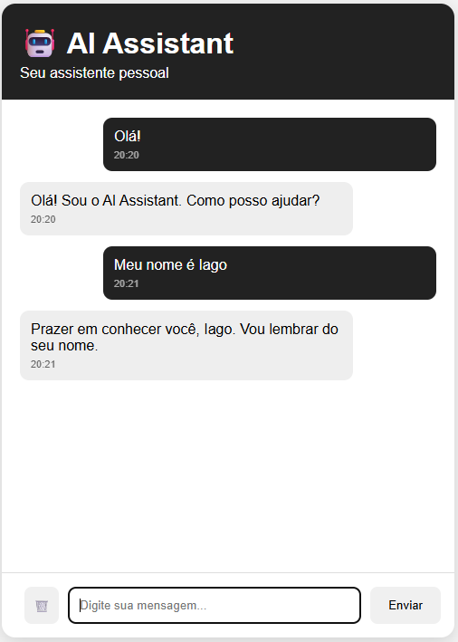

# 🤖 AI Assistant

Um assistente virtual pessoal desenvolvido com **Node.js, Express, JavaScript e SQLite**, com sistema de memória, histórico persistente e arquitetura preparada para integração com modelos de Inteligência Artificial.

O projeto simula um assistente conversacional capaz de armazenar informações do usuário, manter contexto das conversas e responder de acordo com uma personalidade definida.

---

## 📸 Preview



---

## 📌 Sobre o projeto

O **AI Assistant** foi desenvolvido como um projeto Full Stack com o objetivo de criar uma base de assistente virtual escalável.

A aplicação possui uma arquitetura separada entre:

- Interface do usuário
- API Backend
- Sistema de processamento de mensagens
- Sistema de memória
- Provedores de resposta da IA

Essa estrutura permite substituir facilmente o mecanismo local de respostas por uma API de Inteligência Artificial, como OpenAI ou outros modelos de linguagem.

---

# ✨ Funcionalidades

## 💬 Conversação
- Envio e recebimento de mensagens em tempo real
- Interface de chat personalizada
- Efeito de digitação das respostas

## 🧠 Memória
- Histórico persistente das conversas
- Armazenamento utilizando SQLite
- Recuperação automática do histórico ao abrir a aplicação

## 👤 Memória do usuário
O assistente consegue armazenar informações básicas do usuário.

Exemplo:
```
Usuário:
Meu nome é Iago

AI Assistant:
Prazer em conhecer você, Iago. Vou lembrar do seu nome.
```

Depois:
```
Usuário:
Qual meu nome?

AI Assistant:
Seu nome é Iago.
```

---

# 🏗️ Arquitetura

Fluxo da aplicação:

```
Frontend
   |
   |
API REST
   |
   |
Controller
   |
   |
AI Engine
   |
   |
Provider
   |
   |
Memory System
   |
   |
SQLite
```

---

# 🛠️ Tecnologias utilizadas

## Backend
- Node.js
- Express.js
- JavaScript ES Modules
- SQLite
- CORS
- dotenv

## Frontend
- HTML5
- CSS3
- JavaScript Vanilla

## Ferramentas
- Git
- GitHub
- VS Code

---

# 📂 Estrutura do projeto

```
AI-Assistant
│
├── backend
│   │
│   ├── src
│   │   │
│   │   ├── ai
│   │   │   ├── ai.engine.js
│   │   │   ├── personality.js
│   │   │   └── providers
│   │   │       └── local.provider.js
│   │   │
│   │   ├── controllers
│   │   │
│   │   ├── database
│   │   │
│   │   ├── intents
│   │   │
│   │   ├── memory
│   │   │
│   │   ├── routes
│   │   │
│   │   ├── services
│   │   │
│   │   ├── app.js
│   │   └── server.js
│   │
│   └── package.json
│
├── frontend
│   │
│   ├── css
│   │   └── style.css
│   │
│   ├── js
│   │   ├── script.js
│   │   └── user.js
│   │
│   └── index.html
│
└── README.md
```

---

# 🚀 Como executar

## Pré-requisitos
Tenha instalado:

- Node.js
- npm

---

## Backend

Entre na pasta:
```bash
cd backend
```

Instale as dependências:
```bash
npm install
```

Crie um arquivo:

```
.env
```

Com:

```env
PORT=3000

OPENAI_API_KEY=SUA_CHAVE_AQUI
```

Execute:
```bash
npm run dev
```

O servidor iniciará em:

```
http://localhost:3000
```

---

## Frontend

Abra:
```
frontend/index.html
```

no navegador.

---

# 🔌 API

## Verificar status

```
GET /
```

Resposta:

```json
{
  "status": "online",
  "message": "AI Assistant Backend funcionando!"
}
```

---

## Enviar mensagem

```
POST /api/chat
```

Body:

```json
{
  "message": "Olá"
}
```

Resposta:

```json
{
  "response": "Olá! Sou o AI Assistant. Como posso ajudar?"
}
```

---

## Consultar histórico

```
GET /api/history
```

Retorna todas as mensagens armazenadas.

---

# 🔮 Próximas melhorias

Possíveis evoluções:

- [ ] Integração com modelos GPT
- [ ] Autenticação de usuários
- [ ] Sistema de múltiplos usuários
- [ ] Interface utilizando React
- [ ] Banco PostgreSQL
- [ ] Deploy em nuvem
- [ ] Mais ferramentas e comandos
- [ ] Reconhecimento de voz

---

# 👨‍💻 Autor

**Iago Antônio Viana Lima**

Estudante de Ciência da Computação com interesse em Desenvolvimento Full Stack, Inteligência Artificial e criação de aplicações web.

---

⭐ Projeto desenvolvido para estudos e evolução em desenvolvimento de software.
